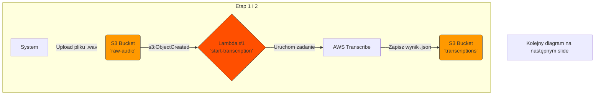
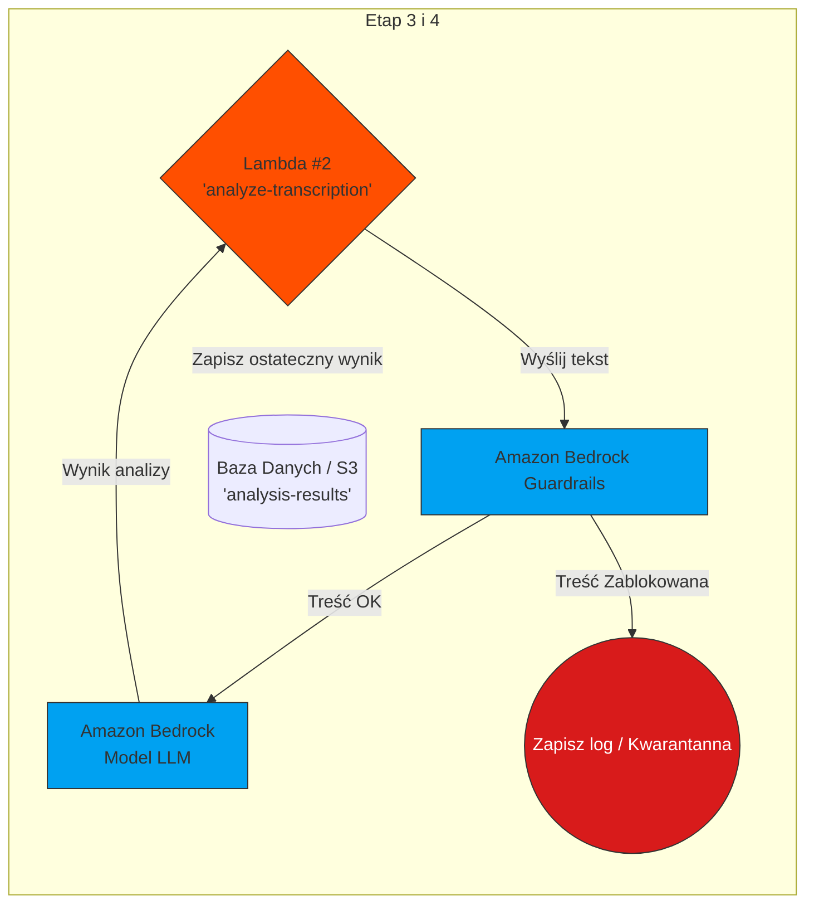

# AWS GameDay

Zabawne, grywalizowane i interaktywne doświadczenie edukacyjne.

---

# Czym jest AWS GameDay?
<v-clicks>

- 🎮 **Grywalizowane Wydarzenie Edukacyjne** - wyzwania dla uczestników do wykorzystania rozwiązań AWS w rozwiązywaniu prawdziwych problemów technicznych w zespołach
- 🚀 **Praktyczne Doświadczenie** - w pełni praktyczna możliwość dla specjalistów technicznych do eksploracji usług AWS, wzorców architektury i najlepszych praktyk
- 🔓 **Otwarty Format** - w przeciwieństwie do tradycyjnych warsztatów, GameDays nie są preskryptywne, dając uczestnikom swobodę eksploracji i kreatywnego myślenia
- 🛡️ **Bezpieczne Środowisko** - eksploruj, eksperymentuj i wprowadzaj innowacje w bezpiecznym środowisku bez obaw o awarie produkcyjne
- 👥 **Współpraca Zespołowa** - wspieranie budowania zespołu i współpracy podczas wspólnego rozwiązywania wyzwań
- 🎯 **Rzeczywiste Scenariusze** - prezentacja usług AWS przy użyciu realistycznych scenariuszy technicznych i działającej infrastruktury AWS
- 🏆 **Element Konkurencyjny** - zespoły rywalizują na tablicach wyników w czasie rzeczywistym podczas nauki i rozwiązywania wyzwań

</v-clicks>

---

# Generative AI GameDay Challenge

W ostatniej edycji pojawiło się skupienie na gen AI.
 Interesuje się trochę tym tematem więc pomyślałem czemu nie

---

# Jak wygląda udział w takim wydarzeniu?

 

Po zapisaniu się dostałem email w którym były wszystkie informacje.  
Spotkanie odbywało się na platfromie Amazon Chime  
Był kod wstępu i po wejściu wchodziło się na spotkanie gdzie było około 45 osób

---

# Wstęp i szybkie wyjaśnienie na czym będzie zabawa polegała

 

Dostaliśmy szybki wstęp o tym jak to będzie wyglądało

- Praca na czas
- Zadania do zrealizowania
- Informacje podstawowe
  - Na call są pracownicy AWS, którzy będą wspierać jak ktoś utknie
  - Praca jest jednoosobowa

---
layout: table-contents
---

# Przejście do własenego pokoju oraz rozpoczęcie zabawy

 

Kiedy juz wszystko było wyjaśnione i upewniliśmy się, ze mamy dostep do konsoli oraz specjalnej platformy z zadaniami (Apka wyklepana i postawiona na cloudfront)

---
layout: new-section
---

# Zadanie 1 - PartyRock

---

## Czym jest PartyRock?

**PartyRock** to plac zabaw Amazon Bedrock do tworzenia aplikacji AI, które można udostępniać innym.

### Główne cechy:
- 🎨 **Eksperymentuj z prompt engineeringiem** - w praktyczny i zabawny sposób
- 🚀 **Buduj, udostępniaj, remiksuj** aplikacje w krótkim czasie
- 🧠 **Ucz się podstaw generative AI** - jak modele odpowiadają na prompty

### Przykłady aplikacji, które możesz stworzyć:
- Generator żartów na wybrany temat
- Tworzenie idealnej playlisty na podstawie gustu muzycznego  
- Rekomendacje posiłków na podstawie składników w lodówce
- Wirtualny quiz online ze znajomymi
- AI storyteller do kampanii RPG

  

---
layout: new-section
---

# Zadanie 2 - Generowanie zdjęć

---

# Aplikacja do generowania zdjęć w python

Kolejnym zadaniem było stworzenie prostej aplikacji webowej do gen.
- Napisać prompty, które będą generowały fajne obrazki
- Oceniana była jakoś generowanych obrazków w zaleznosci od prompt

  

---

# Ale jak to aplikacja webowa w python?

<v-click>

</v-click>

---
layout: cover-logos
logos: [
  'https://www.opc-router.de/wp-content/uploads/2023/07/Docker_150x150px-01-01-01.png',
  'https://miro.medium.com/v2/resize:fit:908/1*w4N8NNxnCo-qhADUe5BsGQ.png',
  'https://encrypted-tbn0.gstatic.com/images?q=tbn:ANd9GcT5s_irQVmNTxnN1YKjl170xsJCJg1YJys2BQ&s',
]
---

# Postawienie aplikacji

- Po zbudowaniu działającej aplikacji lokalnie trzeba było postawic kontener 
- Wypchnąć kontener na ECR
- Postawić apkę przy uzyciu ECS 
- Gotowy link do apki wrzucić do oceny

---
layout: new-section
---

# Zadanie 3 - Analiza rozmowy

---

# Analiza rozmowy z konsultantem

- Rozmowy są przechowywane w formacie WAV na S3
- Trzeba stworzyć transkrypcje tej rozmowy i wyciągnąć metadane

  

---

# Stowrzenie prompta do analizy transkrycpji
 
Po stworzeniu transkrypcji nalezalo przejsc do bedrock studio i pokminc jak dobrze napisac prompta zeby moc mu zadawac pytania o rozmowe i zeby odpowiadal dobrze i nie wymyslal odpowiedzi i danych ktorych tam nie bylo
 
 

- Tutaj była ręczna walidacja tego czyli po testach dostawaliśmy pytania, na które sami musieliśmy odpowiedzieć uzywajac właśnie przygotowanego wcześniej AI

---
layout: image-right
image: ./guardrails.png
class: mt-35
---

# Anonimizacja danych

- Rozmowy z konsultantami zawierały wrazliwe dane takiej jak imie, nazwisko, adres, numer telefonu 

- Przed zafeedowaniem do AI mieliśmy za zadanie pozbyć się tych danych z uwagi na to, ze nie byly nam potrzebne do analizy 

---
layout: image-right
image: "https://upload.wikimedia.org/wikipedia/commons/thumb/5/5c/Amazon_Lambda_architecture_logo.svg/1200px-Amazon_Lambda_architecture_logo.svg.png"
class: mt-40
---

# Spięcie tego wszystkie w całość

Ostatecznie trzeba było połączyć wszystkie te kroki razem za pomocą lambdy

---
layout: center
---
# Inicjacja i Transkrypcja

---
layout: center
---

# Analiza, AI i Zapis

---
layout: image-center
image: ./result.jpeg
imageWidth: '450'
imageHeight: '950'
---

# Wynik

---
layout: center
---

# Thank you!

<PoweredBySlidev mt-10 />
